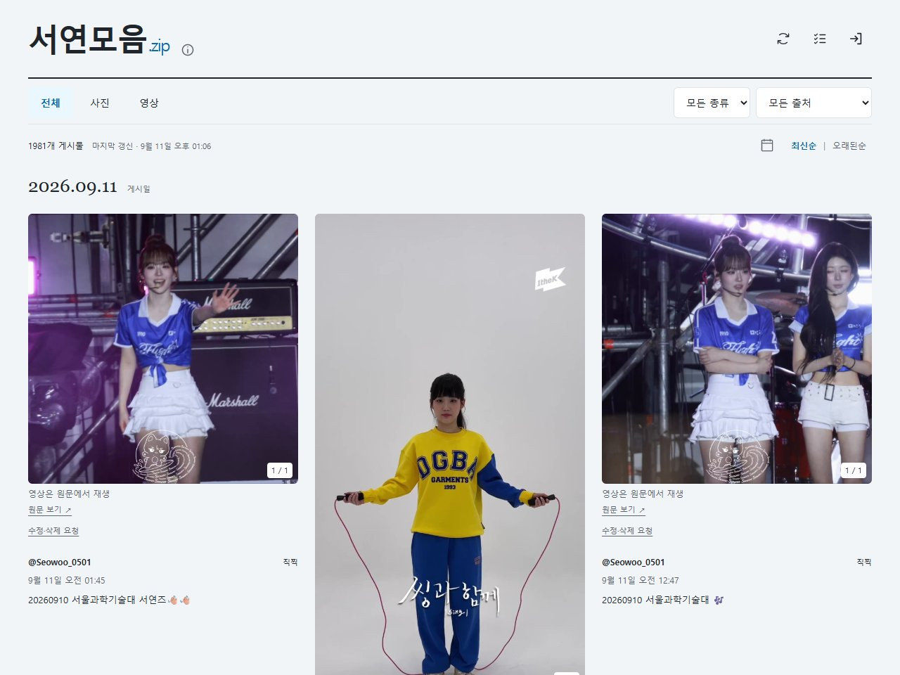
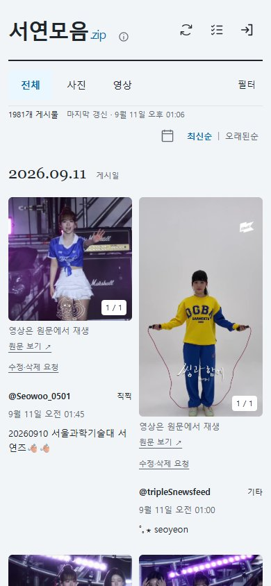

<div align="center">

# 서연모음.zip

**모아두고 싶은 서연의 순간들.**

윤서연의 사진과 영상을 한곳에 모아보는 비공식 팬 아카이브입니다.

**[사이트 보러 가기 ↗](https://seoyeon-zip.seoyeon-archive.workers.dev/)**

</div>



## 모아보고, 골라보고, 원문으로

여러 출처에 흩어진 사진과 영상을 모아보고, 마음에 드는 게시물은 원문에서 이어볼 수 있어요.

- **사진과 영상** — 사진만, 영상만 골라보고 한 게시물의 여러 사진을 넘겨볼 수 있어요.
- **날짜와 출처** — 게시일과 출처로 찾거나, 오래된 게시물부터 차례로 살펴볼 수 있어요.
- **원문 바로가기** — 각 게시물의 원문 링크와 출처를 함께 확인할 수 있어요.
- **수집 현황** — 출처별 수집 상태와 마지막 갱신 시각을 확인할 수 있어요.

열람에는 로그인이 필요하지 않습니다.

## 작은 화면에서도

모바일에서는 두 열의 피드로 사진을 모아봅니다. 날짜·출처 필터와 원문 이동도 그대로 이용할 수 있어요.

<p align="center">
  
</p>

*화면은 2026년 9월 11일 기준이며, 표시되는 게시물은 달라질 수 있습니다.*

## 프로젝트 구성

| 영역 | 사용 기술 |
|---|---|
| 화면 | HTML · CSS · JavaScript |
| API·예약 수집 | Cloudflare Workers · Cron Triggers |
| 데이터 저장 | Cloudflare D1 |
| 운영자 인증 | Cloudflare Access |
| 배포 | GitHub · Cloudflare Workers Builds |
| 검증 | Node Test Runner · Playwright |

예약 작업으로 게시물 메타데이터를 수집하고, 검토·노출 상태에 따라 공개 피드에 표시합니다. 수집 제어와 자료 관리, 검토함은 운영자 인증 후 이용할 수 있습니다.

사진·영상은 원문 출처의 미디어 URL을 사용합니다. 원문 삭제나 제공자 응답에 따라 일부 게시물이 수집되지 않거나 미디어가 표시되지 않을 수 있습니다.

## 개발 및 검증

Node.js **24.14.1 이상**이 필요합니다.

```sh
npm ci
npm test
```

Chrome이 설치된 환경에서는 다음 명령으로 공개 화면과 운영자 화면의 분리, 사이트 안내, 반응형 배치를 확인할 수 있습니다.

```sh
node scripts/check-public-admin.mjs
```

이 검사는 로컬 모의 데이터를 사용하며, 실제 수집 제공자나 운영 DB를 변경하지 않습니다. 화면 캡처는 `.local/`에 저장됩니다.

운영 배포는 GitHub `main` 브랜치와 Cloudflare Workers Builds를 연결해 진행합니다. 별도 환경에 설치하려면 자신의 D1·Access·수집 제공자 설정이 필요합니다.

## 관련 문서

- [디자인 기준](DESIGN.md)
- [기능 명세](docs/SPEC.md)
- [작업 계획](docs/PLAN.md)
- [검증 기록](docs/VALIDATION.md)
- [아이콘 출처·라이선스](docs/icon-licenses/README.md)
- [초기 비공개 검증 안내 — 보관본](docs/INITIAL_VALIDATION.md)

## 출처·저작권 및 문의

서연모음.zip은 비공식 팬 아카이브이며, 아티스트 및 소속사의 공식 서비스가 아닙니다.

게시물과 화면 캡처에 포함된 사진·영상의 저작권은 해당 권리자에게 있습니다. 원문 게시 계정이 실제 창작자와 다를 수 있으며, 출처 표시나 이 저장소의 공개가 콘텐츠 재사용 허락을 뜻하지 않습니다.

게시 중단·출처 수정 요청은 사이트의 **ⓘ → 사이트 안내** 또는 [운영 이메일](mailto:wantraiseapomeranian9@gmail.com)로 보내 주세요. 대상 게시물의 원문 링크, 요청 내용, 콘텐츠와의 관계를 함께 알려주시면 확인 후 필요한 조치를 진행하겠습니다.
